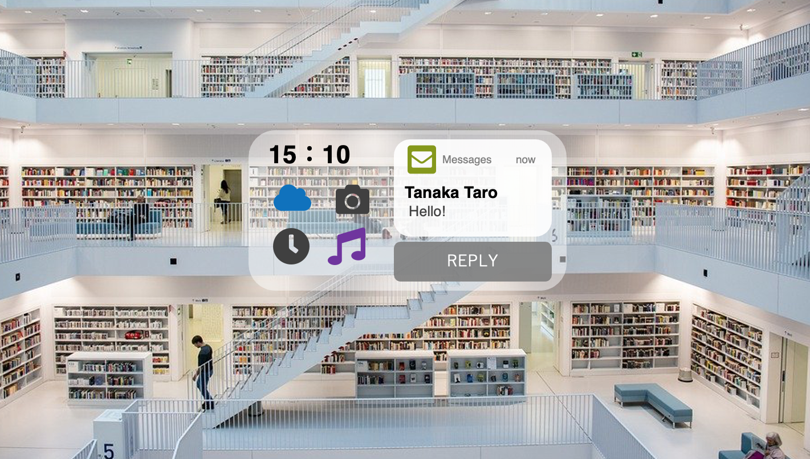
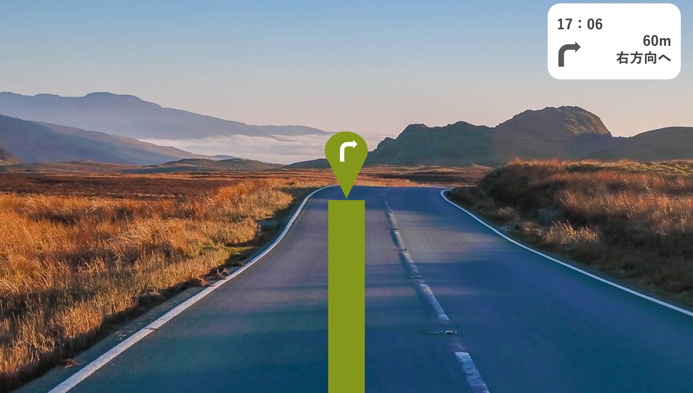
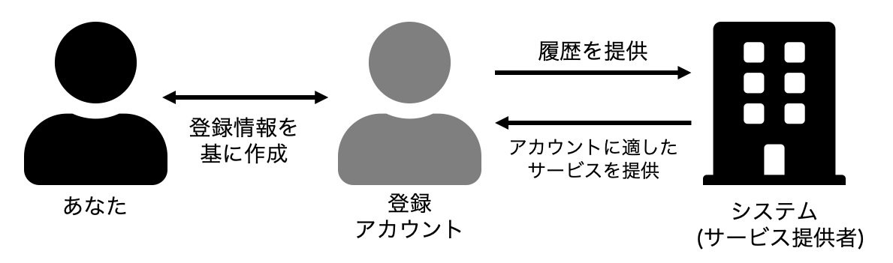

# サービスの説明
現在、あなたは以下の製品に興味を示しており、あなたの手元には無料体験用の製品が既に用意されています。あなたの手元にある製品は、あなたのスマートフォンに専用のアプリケーションをダウンロードし、アカウントを登録すると、無料体験が開始されます。この製品の無料体験を利用できる期間は2週間であり、2週間が経過すると無料体験が終了し、製品を利用できなくなります。

まず、サービスの概要と製品が取得する情報に関する以下の文章を読んでください。

------------------------------------------------------------------------------------------------------------------------------------------
## サービスの概要

こちらは、とある企業が発表したメガネ型ARデバイスです。このメガネ型ARデバイスとあなたが使用しているスマートフォンを連動させることにより、スマートフォンに表示されている画面を現実世界の視界に重ねて表示することができます。また、デバイスを装着している間は、デバイスがあなたの脳波を解析しています。この機能により、あなたは利用したい機能を脳内で想像すると、デバイスが脳波を解析し、あなたの想像通りにデバイスが操作されます。デバイス利用の例を以下に示します。

 

- 例1）写真を撮りたい場合
脳内で「カメラアプリ」を想像すると、カメラアプリが起動します。さらに脳内で「シャッターを押す」と想像すると、カメラアプリのシャッターが押され、写真が撮影されます。

- 例2）メールの通知を確認、返信する場合
デバイスにメールの通知が表示された時、脳内で「メール」と想像すると、メールアプリが起動し、通知されたメールが表示されます。さらに脳内で「返信」と想像すると、返信用のメールフォーマットが作成されます。返信する内容を想像すると、作成された返信用のメールフォーマットに返信する内容が記載されていきます。最後に脳内で「送信」と想像すると作成した返信メールが送信されます。

  

また、あなたに関する情報を提供して頂くと、提供して頂いた情報を基に、サービス内であなたの興味関心にあった情報を提供させて頂きます。提供される情報の例を以下に示します。

 

- 例1）女性、20代、化粧品に関心があり、「新作コスメ」という単語で検索している履歴がある場合
クリスマスが近づくと、クリスマス限定の化粧品の情報が提供されます。

- 例2）男性、40代、興味関心に関する情報として「音楽」を提供しており、デバイスを装着し、ドライブをしている場合
デバイスがドライブ中であることを認識し、普段聴いている音楽のジャンルの中からドライブにあった曲をピックアップし、流してくれます。

 

     
    ↑メガネ型デバイスを装着し、メッセージが届いた際のイメージ

     
    ↑メガネ型デバイスを装着し、地図アプリを使用している際のイメージ

  

## 本製品が取得する情報について
1. アカウント登録情報 
本製品を利用するにあたり、専用のアプリケーションでアカウント登録をして頂く必要があります。アカウント作成時には、パスワードの他に、アカウント登録情報として、以下の情報を入力して頂く必要があります。

    - 姓名
    - アカウント名
    - 性別
    - 生年月日
    - メールアドレス
    - あなたの興味関心に関する情報

 

2. 利用履歴 
デバイスを操作するために必要な脳波の情報、利用したサービスやサービスの機能に関する情報は利用履歴としてサービス提供者に提供していただきます。利用履歴の具体的な情報を以下に示します。

    - デバイスの操作に伴う脳波の情報（あなたがデバイス操作のために脳内で想像した情報であり、あなたの脳内の思考すべてではありません）
    - 利用したサービス・機能に関する情報（Webサイトの場合は、Webサイト名やWebサイトのどこをクリックしたかに関する情報）

 

------------------------------------------------------------------------------------------------------------------------------------------

本調査では、上記のサービスを無料体験することを想定して頂きます。また、現在あなたは自身のスマートフォンに無料体験用のアプリケーションをダウンロードし、アカウントを登録する場面にいると想定してください。このとき、アカウントとして登録する情報（名前など）と、あなた本人の情報は異なるものでも構いませんが、よりあなたに適したサービスを受けるためには、アカウントとして登録する情報と、あなた本人の情報を同じものにする必要があります。

     
    ↑無料体験における「あなた」、「アカウント」、「サービス提供者」の関係図

 
これからいくつかのアカウント登録方法を提案しますので、それぞれの方法についてアンケートにお答えください。アンケートに答える際は、「あなたがそのアカウント登録方法を利用すると想定して」お答えください。

 

