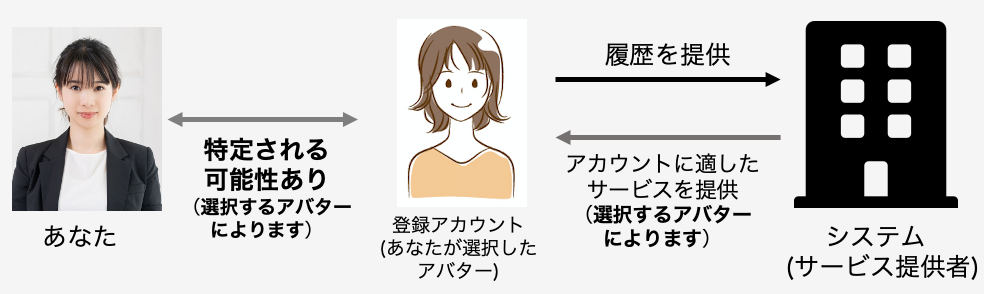

# アバター型の説明および質問項目
アバター型：無料体験内で使用するあなたの分身(以後、アバターと呼ぶ)を作成することによりアカウントの登録が完了する方法 
あなたはこの方法を利用し、無料体験を行うと想定しながら、質問にお答えください。

この方法は、あなたが無料体験内で使用するアバターを作成することにより、アカウント登録が完了する方法です。アバターの作成にあたり、システムからアカウント登録に用いる姓名、アカウント名、生年月日、性別、メールアドレスおよび興味関心に関する情報の候補が多数用意されます。（システムが用意する情報はアカウントを作成するたびに変化します。）あなたには、システムが用意した情報を自由に組み合わせ、アバターを作成して頂きます。最後に、パスワードを設定して頂くと、アカウント登録が完了します。

この方法では、あなたと似ているアバターを作成することも、あなたとは似ていないアバターを作成することもできます。あなたが「あなたと似ているアバター」を作成した場合、アバターの情報と利用履歴に基づいて、よりあなたの興味関心にあったサービスが提供されます。また、あなたが作成したアバターの情報から、あなたの本名や生年月日、性別等を特定される可能性は変化します。たとえば、あなたが「あなたと全く似ていないアバター」を作成した場合、あなたの本名や生年月日、性別等を特定できる可能性は低くなります。また、あなたが「あなたとよく似ているアバター」を作成した場合、あなたの本名や生年月日、性別等を特定できる可能性は高くなります。サービス提供者は、この方法により登録したアカウントの情報および利用履歴（あなたが製品を利用した情報）をそのまま記録します。

  

     
    ↑サービス提供者へアカウント情報、利用履歴が提供される際のイメージ（アバターはイメージです） 
    *この顔画像はイメージです！あなたの顔画像を提供するわけではありません

     
    ↑アカウント登録画面のイメージ 
    各入力項目に入力可能な情報の候補が表示されます。候補の中から情報を選択し、「登録」ボタンを押すとアカウント登録は完了します。 
    *この顔画像はイメージです！あなたの顔画像を提供するわけではありません

 
 

## 質問項目
- [PC1]本ページで説明したアカウント管理方法（アバター型）で情報を提供することは、危険だと思う
- [PC2]本ページで説明したアカウント管理方法（アバター型）で情報を提供することは、あなたのプライバシーに関連した不確実なことが多く存在すると思う
- [PC3]本ページで説明したアカウント管理方法（アバター型）で情報を提供した場合、あなたのプライバシーに関連した多くの予期しない問題が発生する可能性を伴うと思う
- [PC4]本ページで説明したアカウント管理方法（アバター型）で情報を提供した場合、サービス提供者があなたの利用履歴からサービス内でのあなたの行動を追跡できるという事実について、どの程度不安を感じますか
- [PC5]本ページで説明したアカウント管理方法（アバター型）で情報を提供した場合、あなたの提供した情報が提供した理由以外の目的で使用される可能性があることをどの程度不安を感じますか
- [PC6]本ページで説明したアカウント管理方法（アバター型）で情報を提供した場合、サービス提供者があなたの情報を第三者に提供することについて、どの程度不安を感じますか
- [PC7]本ページで説明したアカウント管理方法（アバター型）で情報を提供した場合、あなたが提供した情報を用いてサービス提供者があなたに通知や(メールアドレスを提供した場合は)メールを送る可能性があることについて、どの程度不安を感じますか
- [PC8]本ページで説明したアカウント管理方法（アバター型）で情報を提供した場合、あなた自身を特定できない情報をサービス提供者に提供することについて、どの程度不安を感じますか
    - あなた自身を特定できない情報とは...サービス提供者へ提供しても、それだけではあなたが誰であるかを特定することができない情報です。ただし、サービス提供者のデータベースへ残ります。例) 性別、年齢など
- [BN1]本ページで説明したアカウント管理方法（アバター型）で性別に関する情報を提供した場合、性別に関する情報に基づいて提供されるサービスは，あなたにとってどの程度快適だと思いますか
    - あなたが従来のアカウント管理方法を利用した場合に、あなたの性別に関する情報に基づいて提供されるサービスを「とても快適である(7)」に相当すると想定してください。
- [BN2]本ページで説明したアカウント管理方法（アバター型）で年齢に関する情報を提供した場合、年齢に関する情報に基づいて提供されるサービスは，あなたにとってどの程度快適だと思いますか
    - あなたが従来のアカウント管理方法を利用した場合に、あなたの年齢に関する情報に基づいて提供されるサービスを「とても快適である(7)」に相当すると想定してください。
- [BN3]本ページで説明したアカウント管理方法（アバター型）で興味関心に関する情報を提供した場合、興味関心に関する情報に基づいて提供されるサービスは、あなたにとってどの程度快適だと思いますか
    - あなたが従来のアカウント管理方法を利用した場合に、あなたの興味関心に関する情報に基づいて提供されるサービスを「とても快適である(7)」に相当すると想定してください．
- [BI]本メガネ型ARデバイスの無料体験に、本ページで説明したアカウント管理方法（アバター型）が利用されているとします。このとき、従来のアカウント管理方法を利用する場合と比較して、あなたがこの無料体験を利用する可能性はどの程度高くなりますか、または低くなりますか
    - 従来のアカウント管理方法とは...サービストライアル、無料体験の段階で自身に関する情報(例：姓名、生年月日、性別、電話番号、住所等)を正確に登録することが必須であることを指します
- [Reason_negative]1つ前の質問で、あなたがその選択肢を選んだ理由を教えてください。(複数回答可) 当てはまる理由がない場合は、「その他」に選択肢を選んだ理由を記載してください。
    - [RN1]このページで説明された登録方法にはメリットまたは魅力を感じないから
    - [RN2]このページで説明された登録方法には個人情報が特定される可能性があるから
    - [RN3]このページで説明された登録方法はサービスが使いにくくなるから
    - [RN4]このページで説明された登録方法は信頼できないから
    - その他
- [Reason_positive]1つ前の質問で、あなたがその選択肢を選んだ理由を教えてください。(複数回答可) 当てはまる理由がない場合は、「その他」に選択肢を選んだ理由を記載してください。
    - [RP1]このページで説明された登録方法にメリットまたは魅力を感じるから
    - [RP2]このページで説明された登録方法は個人情報が保存されないから
    - [RP3]多少サービスが使いにくくても個人情報は提供したくないから
    - [RP4]このページで説明された登録方法は信頼できるから
    - その他