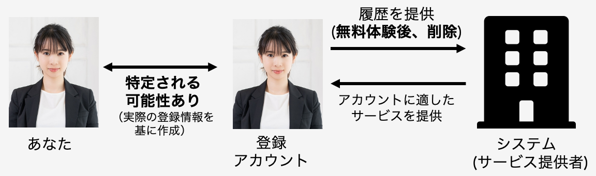
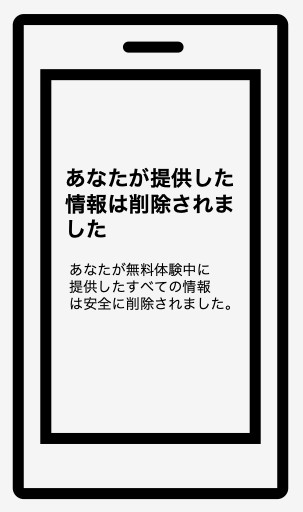

# 削除型の説明および質問項目

削除型：無料体験後に無料体験中に提供した全ての情報が削除される方法 
あなたはこの方法を利用し、無料体験を行うと想定しながら、質問にお答えください。

この方法では、アカウントの作成に用いる姓名、アカウント名、生年月日、性別、メールアドレス、パスワードおよび興味関心に関する情報を項目に従い入力していただくと、アカウント登録が完了し、そのまま無料体験が開始されます。そして、無料体験が終了後、あなたが提供したアカウント情報や利用履歴といったすべての情報をサービス提供者が削除したことを通知する画面が表示される方法です。

この方法では、サービス提供者はアカウント情報および利用履歴を無料体験後に削除しますが、あなたが登録したアカウントの情報からあなたの本名や性別、生年月日等の個人情報を特定される可能性はあります。ただし、サービス提供者は無料体験終了後にこれらの情報をすべて削除し、その後利用することはありません。システムはあなたが提供した情報を最大限活用し、あなたの興味関心にあった情報を提供します。

  

     
    ↑サービス提供者へアカウント情報、利用履歴が提供される際のイメージ 
    *この顔画像はイメージです！あなたの顔画像を提供するわけではありません

 

     
    ↑アカウント登録画面のイメージ 
    入力項目に従い、項目を埋めていただき、「登録」ボタンを押すと、 アカウント登録が完了します。 
    *この顔画像はイメージです！あなたの顔画像を提供するわけではありません

 

     
    ↑無料体験終了後、あなたが提供した情報が削除されたことを通知する画面のイメージ 
    *この顔画像はイメージです！あなたの顔画像を提供するわけではありません

  

## 質問項目
- [PC1]本ページで説明したアカウント管理方法（削除型）で情報を提供することは、危険だと思う
    - 全く危険ではない(1)
    - あまり危険ではない(2)
    - やや危険ではない(3)
    - どちらとも言えない(4)
    - やや危険である(5)
    - かなり危険である(6)
    - とても危険である(7)
- [PC2]本ページで説明したアカウント管理方法（削除型）で情報を提供することは、あなたのプライバシーに関連した不確実なことが多く存在すると思う
    - 全くそう思わない(1)
    - かなりそう思わない(2)
    - ややそう思わない(3)
    - どちらとも言えない(4)
    - ややそう思う(5)
    - かなりそう思う(6)
    - とてもそう思う(7)
- [PC3]本ページで説明したアカウント管理方法（削除型）で情報を提供した場合、あなたのプライバシーに関連した多くの予期しない問題が発生する可能性を伴うと思う
    - 全くそう思わない(1)
    - かなりそう思わない(2)
    - ややそう思わない(3)
    - どちらとも言えない(4)
    - ややそう思う(5)
    - かなりそう思う(6)
    - とてもそう思う(7)
- [PC4]本ページで説明したアカウント管理方法（削除型）で情報を提供した場合、サービス提供者があなたの利用履歴からサービス内でのあなたの行動を追跡できるという事実について、どの程度不安を感じますか
    - 全く不安を感じない(1)
    - あまり不安を感じない(2)
    - やや不安を感じない(3)
    - どちらとも言えない(4)
    - やや不安を感じる(5)
    - かなり不安を感じる(6)
    - とても不安を感じる(7)
- [PC5]本ページで説明したアカウント管理方法（削除型）で情報を提供した場合、あなたの提供した情報が提供した理由以外の目的で使用される可能性があることをどの程度不安を感じますか
    - 全く不安を感じない(1)
    - あまり不安を感じない(2)
    - やや不安を感じない(3)
    - どちらとも言えない(4)
    - やや不安を感じる(5)
    - かなり不安を感じる(6)
    - とても不安を感じる(7)
- [PC6]本ページで説明したアカウント管理方法（削除型）で情報を提供した場合、サービス提供者があなたの情報を第三者に提供することについて、どの程度不安を感じますか
    - 全く不安を感じない(1)
    - あまり不安を感じない(2)
    - やや不安を感じない(3)
    - どちらとも言えない(4)
    - やや不安を感じる(5)
    - かなり不安を感じる(6)
    - とても不安を感じる(7)
- [PC7]本ページで説明したアカウント管理方法（削除型）で情報を提供した場合、あなたが提供した情報を用いてサービス提供者があなたに通知や(メールアドレスを提供した場合は)メールを送る可能性があることについて、どの程度不安を感じますか
    - 全く不安を感じない(1)
    - あまり不安を感じない(2)
    - やや不安を感じない(3)
    - どちらとも言えない(4)
    - やや不安を感じる(5)
    - かなり不安を感じる(6)
    - とても不安を感じる(7)
- [PC8]本ページで説明したアカウント管理方法（削除型）で情報を提供した場合、あなた自身を特定できない情報をサービス提供者に提供することについて、どの程度不安を感じますか
    - あなた自身を特定できない情報とは...サービス提供者へ提供しても、それだけではあなたが誰であるかを特定することができない情報です。ただし、サービス提供者のデータベースへ残ります。例) 性別、年齢など
        - 全く不安を感じない(1)
        - あまり不安を感じない(2)
        - やや不安を感じない(3)
        - どちらとも言えない(4)
        - やや不安を感じる(5)
        - かなり不安を感じる(6)
        - とても不安を感じる(7)
- [BN1]本ページで説明したアカウント管理方法（削除型）で性別に関する情報を提供した場合、性別に関する情報に基づいて提供されるサービスは，あなたにとってどの程度快適だと思いますか
    - あなたが従来のアカウント管理方法を利用した場合に、あなたの性別に関する情報に基づいて提供されるサービスを「とても快適である(7)」に相当すると想定してください。
        - 全く快適ではない(1)
        - あまり快適ではない(2)
        - やや快適ではない(3)
        - どちらとも言えない(4)
        - やや快適である(5)
        - かなり快適である(6)
        - とても快適である(7)
- [BN2]本ページで説明したアカウント管理方法（削除型）で年齢に関する情報を提供した場合、年齢に関する情報に基づいて提供されるサービスは，あなたにとってどの程度快適だと思いますか
    - あなたが従来のアカウント管理方法を利用した場合に、あなたの年齢に関する情報に基づいて提供されるサービスを「とても快適である(7)」に相当すると想定してください。
        - 全く快適ではない(1)
        - あまり快適ではない(2)
        - やや快適ではない(3)
        - どちらとも言えない(4)
        - やや快適である(5)
        - かなり快適である(6)
        - とても快適である(7)
- [BN3]本ページで説明したアカウント管理方法（削除型）で興味関心に関する情報を提供した場合、興味関心に関する情報に基づいて提供されるサービスは、あなたにとってどの程度快適だと思いますか
    - あなたが従来のアカウント管理方法を利用した場合に、あなたの興味関心に関する情報に基づいて提供されるサービスを「とても快適である(7)」に相当すると想定してください。
        - 全く快適ではない(1)
        - あまり快適ではない(2)
        - やや快適ではない(3)
        - どちらとも言えない(4)
        - やや快適である(5)
        - かなり快適である(6)
        - とても快適である(7)
- [BI]本メガネ型ARデバイスの無料体験に、本ページで説明したアカウント管理方法（削除型）が利用されているとします。このとき、従来のアカウント管理方法を利用する場合と比較して、あなたがこの無料体験を利用する可能性はどの程度高くなりますか、または低くなりますか
    - 従来のアカウント管理方法とは...サービストライアル、無料体験の段階で自身に関する情報(例：姓名、生年月日、性別、電話番号、住所等)を正確に登録することが必須であることを指します
        - 非常に低い(1)
        - かなり低い(2)
        - やや低い(3)
        - どちらとも言えない(4)
        - やや高い(5)
        - かなり高い(6)
        - 非常に高い(7)
- [Reason]1つ前の質問で、あなたがその選択肢を選んだ理由を教えてください。(複数回答可) 当てはまる理由がない場合は、「その他」に選択肢を選んだ理由を記載してください。
    - [Reason_Negative]の場合([BI]の回答において選択肢1〜3を選択した場合)
        - [RN1]このページで説明された登録方法にはメリットまたは魅力を感じないから(魅力)
        - [RN2]このページで説明された登録方法には個人情報が特定される可能性があるから(プライバシー)
        - [RN3]このページで説明された登録方法はサービスが使いにくくなるから(サービス優先度)
        - [RN4]このページで説明された登録方法は信頼できないから(信頼)
        - その他
    - [Reason_Positive]の場合([BI]の回答において選択肢5〜7を選択した場合)
        - [RP1]このページで説明された登録方法にメリットまたは魅力を感じるから(魅力)
        - [RP2]このページで説明された登録方法は個人情報が保存されないから(プライバシー)
        - [RP3]多少サービスが使いにくくても個人情報は提供したくないから(サービス優先度)
        - [RP4]このページで説明された登録方法は信頼できるから(信頼)
        - その他
